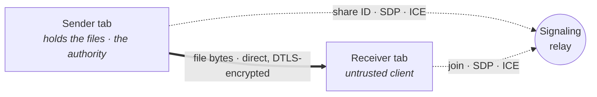

<div align="center">

# wormdrive

**Peer-to-peer file shares that vanish.**

Drop in files, get three links, serve them straight from your browser tab.
Nothing is uploaded — bytes move browser-to-browser over an encrypted WebRTC
channel. Close the tab and the share is gone.


-3dd68c)


[**Live demo**](https://wormdrive.app) ·
[How it works](#how-it-works) ·
[Permissions](#permission-levels) ·
[Security](#security--threat-model) ·
[How it's verified](#how-its-verified) ·
[Run it](#run-it)

</div>

---

A small, self-hostable tool for sharing files without putting a server in the path
of the bytes. You stage files in a browser tab; it mints three permission-scoped
links; whoever opens one connects directly to your tab over a WebRTC data channel.
The relay only brokers the introduction. The share lives in the sender's tab and is
written nowhere else.

The engineering profile is deliberately small: a frontend with zero framework
dependencies, a relay that is ~290 lines of plain Node with the single dependency
`ws`, and ops tooling that is hand-rolled POSIX `sh`. It runs on a 1-core VPS
because the only thing the server ever moves is a few kilobytes of SDP per
connection.

## Three links

Stage files and wormdrive hands you one link per permission level. Each is just a URL:

```text
https://wormdrive.app/#r=uNu1hJv1l5pZ&t=v4QJBmJlgssC6DXkmmPCEQ
```

`r` (`uNu1hJv1l5pZ`) is the **share id** — the relay's room key, all it needs to put
the two tabs in the same room. `t` (`v4QJBmJlgssC6DXkmmPCEQ`) is a **128-bit token**
the relay never sees: it rides only the peer-to-peer channel, and the sender checks
it in constant time. Both sit after the `#`, so they are a URL *fragment* — never
sent in the HTTP request, never in a server access log, never in a `Referer` header.

## How it works

The relay introduces two browsers and then steps aside. Once they have exchanged
SDP and ICE, file bytes flow directly between them over a DTLS-encrypted data
channel and never pass through the server.



The sender's tab is the authority — every permission and destruction decision is
made and enforced where the files live — and it treats the receiver as untrusted.
The next section is the actual traffic that carries that out.

## A share, end to end

You stage files; a flat **manifest** (`{ path, size, kind }` per file) is derived,
directories rebuilt on the other side and never sent. From there, two channels carry
the rest — and they carry completely different things. Here is one real session: a
`download` link connecting and fetching a file.

**Through the relay.** It only routes these frames; the `signal` payload is an opaque
SDP/ICE blob it never opens (`→` is sent to the relay, `←` is received from it):

```text
sender   → {"t":"create","shareId":"uNu1hJv1l5pZ"}
sender   ← {"t":"created"}
receiver → {"t":"join","shareId":"uNu1hJv1l5pZ"}
receiver ← {"t":"joined","peerId":"p1"}
sender   ← {"t":"peer","peerId":"p1"}
sender   → {"t":"signal","to":"p1","data":{"desc": «SDP offer» }}
receiver ← {"t":"signal","from":"host","data":{"desc": «SDP offer» }}
receiver → {"t":"signal","to":"host","data":{"desc": «SDP answer» }}
sender   ← {"t":"signal","from":"p1","data":{"desc": «SDP answer» }}
           … more "signal" frames trickle ICE candidates, both ways …
```

**Over the data channel.** Direct, DTLS-encrypted, the relay sees none of it (`→` is
sent to the peer on the other end):

```text
receiver → {"t":"hello","token":"v4QJBmJlgssC6DXkmmPCEQ"}
sender   → {"t":"grant","level":"download","name":"Q3 docs",
            "manifest":[{"path":"report.pdf","size":184232,"kind":"pdf"}, …]}
receiver → {"t":"get","id":7,"path":"report.pdf","intent":"preview"}
sender   → {"t":"file-head","id":7,"path":"report.pdf","size":184232,"mime":"application/pdf"}
sender   → «184232 raw bytes — ArrayBuffer chunks of 64 KiB, in order»
sender   → {"t":"file-eof","id":7}
```

The token appears only on the second list. So do the bytes. That split is the entire
privacy model. A bad token gets `{"t":"deny"}` instead of a grant; `{"t":"destroy"}`
from a `manage` link ends the share for everyone with a final `{"t":"destroyed"}`.

## Permission levels

Every share mints three independent links. Each carries a separate secret token,
and the level it grants is enforced by the **sender's** browser; the receiver's UI
only hides controls the level cannot use.

| Level | Can |
|---|---|
| `view` | browse the tree and open inline previews — no downloads |
| `download` | the above, plus download any file |
| `manage` | the above, plus destroy the share remotely |

The sender re-checks the level on every request. How tokens are matched and requests
gated is in the [threat model](#security--threat-model) — and small enough to read.

## Inline viewers

The receiver is a keyboard-first file browser with in-page previews.

| Kind | Rendered with | Notes |
|---|---|---|
| Code & text | highlight.js | ~40 languages; truncated at 1.5 MB (`TEXT_PREVIEW_CAP`) |
| PDF | pdf.js | first 20 pages eagerly, the rest on demand |
| Spreadsheets | SheetJS | `.xlsx .xls .csv .tsv .ods`, parsed in a Web Worker |
| Word | mammoth | `.docx` (legacy binary `.doc` is download-only) |
| Images · audio · video | native | browser-native elements |

Rich previews of untrusted documents render in a sandboxed path; see the
[threat model](#security--threat-model) for the iframe and worker hardening and the
`xlsx` tarball pin.

Navigation is keyboard-driven: `/` filters across the whole share, arrows and Enter
navigate, Backspace goes up a folder, and ←/→ page between previews. The receiver
also warms a blob cache speculatively as you browse (idle folder scan, hover intent,
the neighbors of the current preview); amber dots mark items already in memory. A
click jumps the queue, though the wire still carries one transfer at a time.

## Security & threat model

Both ends of the data channel treat the other as untrusted. The defenses live on the
side that owns each guarantee.

**Assets:** the file bytes in the sender's tab; the three per-share tokens; the
existence and lifetime of the share; the receiver tab's integrity while it renders
attacker-supplied content; the relay process.

**Actors and what they're trusted with:**

- **Sender tab** — the authority. Holds the files; enforces permission, validation,
  and destruction. Trusts nothing downstream.
- **Receiver tab** — untrusted by the sender, which assumes it will forge frames,
  lie about sizes, and ignore its own UI.
- **Relay** — untrusted for confidentiality. Routes SDP/ICE and share ids and serves
  static assets; never carries a token, a file name, or a byte.
- **Network path (including any TURN relay)** — untrusted; carries DTLS only.

### Threats and mitigations

| Threat | Vector | Mitigation | Enforced in |
|---|---|---|---|
| Token theft / forgery | Hostile receiver lies about its token or forges a request | ~128-bit CSPRNG tokens carried in the URL hash (never sent to the server, so never in its logs); constant-time compare; level re-checked on every request | `src/protocol.ts`, `src/dom.ts` (`safeEqual`), `src/sender.ts` |
| Poisoned manifest | Hostile sender ships a manifest with traversal, absolute, backslash, or control-byte paths, bad sizes/kinds, or extra props | `sanitizeManifest` rejects on entry count vs `MAX_MANIFEST_ENTRIES=5000`, path length `1024`, traversal/absolute/backslash paths, control bytes, sizes, kinds, and attacker props — so a receiver that streams the manifest into a zip can't be zip-slipped | `src/protocol.ts` (`sanitizeManifest`) |
| Memory exhaustion from a lying sender | Sender declares a `file-head` size larger than the manifest entry | Declared size is clamped to the manifest; a sender that lies is disconnected | `src/protocol.ts` (`validFileHeadSize`), `src/receiver.ts` |
| Malicious document | Crafted `.docx` or spreadsheet attacks the renderer | Rich previews render in a fully sandboxed (`sandbox=""`) iframe; spreadsheet parsing runs in a Web Worker with a kill-timeout, so a malformed file can hang a worker but not the receiver tab | `src/viewers/docx.ts`, `src/viewers/sheet.worker.ts` |
| Supply chain on `xlsx` | A vulnerable SheetJS release reaches the renderer | Pinned to a patched SheetJS tarball from `cdn.sheetjs.com` (the last npm release carries known advisories); since the pin is a direct tarball, `npm audit` can't track it — re-check [SheetJS releases](https://cdn.sheetjs.com/) when bumping deps | `package.json` |
| Relay abuse / flood | One client opens many rooms, floods peers, or sends oversized frames | One room per socket, `MAX_PEERS_PER_ROOM=32`, `MAX_ROOMS=5000`, `maxPayload` 256 KiB, a role-grace reaper, a traversal-confined static root; peers can only address the host; headers set CSP, `nosniff`, frame-deny, `no-referrer` | `server/signaling.mjs` (env-overridable) |
| Network eavesdrop, incl. TURN | Attacker on the path, or a relaying TURN server, tries to read bytes | The data channel is always DTLS-encrypted, so a TURN relay in the path can't read it, and bytes never flow through the signaling relay | WebRTC transport |
| Stale share access | A link is used after the owner intends the share gone | Destruct enforced at access time *and* by an auto-destruct timer; destroying nulls the tokens, so a throttled background tab can't serve past the deadline | `src/sender.ts` |

A signaling blip doesn't drop live transfers: the host replays `create` so existing
data channels survive while new peers can still join (`src/signaling.ts`).

### The enforcement is small enough to read

The trust boundary isn't a framework — it's a handful of pure functions in
[`src/protocol.ts`](src/protocol.ts), tested without a browser. The *entire* defense
against a sender that lies about a file's size to OOM the receiver is this:

```ts
export function validFileHeadSize(size: number, manifestSize: number): boolean {
  return Number.isFinite(size) && size >= 0 && size <= manifestSize;
}
```

A `file-head` claiming more than the manifest already published for that path is a
lie, and the receiver drops the connection. Permission is the same shape — one
function returns the reason a request is refused, or `null` to allow it:

```ts
permissionDenial("view", "image", "download")   // → "This link is preview-only."
permissionDenial("view", "other", "preview")    // → "This link can only open previewable files."
permissionDenial("download", "pdf", "download")  // → null   (allowed)
```

### Residual risks and out of scope

These are accepted risks, not defended boundaries.

- **`view` is soft enforcement.** Rendering a preview hands the bytes to the browser,
  so a determined viewer can extract them; it stops casual downloads, not deliberate
  exfiltration.
- **A malicious signaling server could MITM the SDP handshake.** Self-host the relay
  (~290 lines) if that is in your threat model.
- **Downloads stream to disk where the browser allows it.** With the File System
  Access API (Chromium) a single file — or a whole folder, zipped on the fly —
  streams straight to disk, so its size isn't bounded by the tab's memory, and the
  sender paces itself to the receiver's disk (credit-based flow control) so the
  in-flight bytes stay bounded too. The streamed folder zip is ZIP64, so a single
  file and the whole archive can each exceed 4 GiB. Browsers without the API
  (Firefox, Safari) fall back to assembling the download in memory before saving,
  which a multi-GB selection can exhaust.
- **A link confers its powers on anyone holding it** until the share is destroyed.

## How it's verified

The guarantees above are about adversarial behavior, so the suite attacks the code
rather than trusting it — **88 checks** across four layers. `npm run check` runs the
first two; `npm run test:headers` and `npm run test:e2e` (which need a build) run the
rest.

- **Unit (42)** — the pure decision logic in isolation: manifest sanitization (the
  `1024`/`5000` boundaries, attacker props, backslash/control-byte paths), the
  permission truth table, the file-head clamp, the download flow-control gate, the
  token alphabet and constant-time compare, and the store-only zip writer (CRC-32
  vectors, central-directory offsets, and streamed multi-entry/empty/ZIP64
  archives). [test/](test)
- **Signaling smoke (18)** — spawns a real relay and drives the protocol, then the
  abuse defenses: the 33rd peer is refused, an oversized/malformed frame is dropped
  without crashing, a forged peer→peer target still lands on the host only, a
  role-less socket is reaped. [scripts/smoke-signaling.mjs](scripts/smoke-signaling.mjs)
- **HTTP headers (12)** — boots the static server and `curl`s it: CSP and security
  headers present, an encoded `../` is `403`, a malformed `%`-encoding is `400` not a
  crash, the SPA fallback works. [scripts/smoke-headers.mjs](scripts/smoke-headers.mjs)
- **Two-tab end-to-end (16)** — two real headless-Chrome tabs over a real WebRTC data
  channel. This is the proof the words above are true; the actual run:

```text
$ npm run test:e2e
ok: sender staged files and minted three permission links
ok: receiver connected over WebRTC and received the manifest (download link)
ok: receiver previewed hello.txt — file bytes transferred over the data channel
ok: download link exposes a Download control
ok: download-all streamed the whole folder to disk as a valid zip (3 files, content intact)
ok: download streamed a single file straight to disk (no zip wrapper, bytes intact)
ok: in-memory fallback (no File System Access API) bundled the folder into a zip
ok: a file larger than the flow-control window streamed to a slow sink without stalling
ok: a failed disk write surfaced an error instead of wedging the receiver
ok: receiver connected over WebRTC (view link)
ok: view link locks the non-previewable file (secret.bin)
ok: view link previews but offers no Download control (preview-only enforced)
ok: spreadsheet (data.csv) parsed in a Web Worker and rendered
ok: manage link destroyed the share — connected peers were notified
ok: sender honored the remote destroy and ended the share
ok: receiver disconnected a sender that lied about a file's declared size
all e2e smoke tests passed (16 checks)
```

The last line is `validFileHeadSize` doing its job against a scripted malicious
sender, observed at the wire. [scripts/smoke-e2e.mjs](scripts/smoke-e2e.mjs)

CI (`.github/workflows/ci.yml`) runs the gate on Linux, macOS, and Windows (Node 22 &
24) plus a Chrome e2e job, so a regression — or a platform-specific break — is caught
on every push.

## Where to look

| Capability | Source |
|---|---|
| Signaling relay | [server/signaling.mjs](server/signaling.mjs), [src/protocol.ts](src/protocol.ts) |
| Permission enforcement | [src/protocol.ts](src/protocol.ts) · `permissionDenial`, [src/sender.ts](src/sender.ts) |
| Manifest validation | [src/protocol.ts](src/protocol.ts) · `sanitizeManifest` |
| Bounded buffering | [src/receiver.ts](src/receiver.ts), [src/protocol.ts](src/protocol.ts) · `validFileHeadSize` |
| Backpressure | [src/rtc.ts](src/rtc.ts) · `sendWithBackpressure` |
| Self-destruct | [src/sender.ts](src/sender.ts) |
| Relay resource caps | [server/signaling.mjs](server/signaling.mjs) |
| Untrusted document rendering | [src/viewers/sheet.worker.ts](src/viewers/sheet.worker.ts), [src/viewers/docx.ts](src/viewers/docx.ts) |
| Signaling reconnect | [src/signaling.ts](src/signaling.ts) |

## Run it

Requires Node ≥ 20 and a modern browser.

```sh
npm install
npm run dev        # signaling on :8787, Vite on :5173 (with a /ws proxy)
```

Open <http://localhost:5173>, add files, and open a share. Paste a link into
another browser to receive.

Production is one process — the signaling server also serves the built frontend:

```sh
npm run build
npm start          # :8787   (PORT=9000 npm start to change it)
```

### Development

```sh
npm run check      # typecheck + lint + unit tests + signaling smoke — the CI gate
npm run test:headers   # static-server CSP / headers / traversal (needs a build)
npm run test:e2e   # two headless-Chrome tabs over a real data channel (needs a build + Chrome)
```

`test:e2e` retries a flaky WebRTC connect in a fresh process, so it's reliable to
gate on. `test:unit` uses Node's type stripping, so it needs Node ≥ 22.6 — the relay
itself runs on ≥ 20.

## Deployment

`./configure` + `make`, hand-rolled POSIX `sh` (no autotools). `configure` captures
host/domain/port into a generated `Makefile`; from there it's two verbs:

```sh
./configure --host root@<vps-ip>
make provision     # once: bootstrap a fresh Debian/Ubuntu box
make deploy        # each release: build locally, sync, restart, healthcheck
```

- **Atomic releases.** Artifacts build locally, rsync to `dist.staging`, then swap in
  with two renames — the live tree is never half-updated. The displaced tree is kept,
  and `make rollback` flips back to it.
- **Sized for 1 core / 1.5 GB.** One runtime dependency (`ws`), Node's heap capped in
  a memory-fenced systemd unit, a swapfile for OOM headroom, journald capped so logs
  can't fill the disk.
- **TLS with no app config.** Point A/AAAA records at the box; Caddy fetches the
  certificate once they resolve. Share links come out `https://…/#r=…&t=…`, and the
  client derives `wss://` from the page origin.

`make check` runs the typecheck + signaling smoke on the box; `make help` lists the rest.

## Networking

A public STUN server handles NAT traversal, which covers most home and office
networks. If both ends are behind strict/symmetric NAT, add a TURN relay to
`ICE_SERVERS` in `src/protocol.ts` — for example:

```ts
export const ICE_SERVERS: RTCIceServer[] = [
  { urls: "stun:stun.l.google.com:19302" },
  { urls: "turn:turn.example.com:3478", username: "u", credential: "secret" },
];
```

A TURN relay only forwards the encrypted channel; it cannot read the traffic (see
the [threat model](#security--threat-model)).

## Project layout

```
server/signaling.mjs          WS relay + static server (plain Node, one dep: ws)
src/main.ts                   entry point — route by URL hash, mount sender/receiver
src/protocol.ts               shared constants, wire shapes, manifest + request policy
src/sender.ts                 stage files, mint links, serve peers, destroy
src/receiver.ts               join, browse, preview, download
src/rtc.ts                    WebRTC plumbing + backpressure
src/signaling.ts              reconnecting WS client
src/manifest.ts               file classification + folder tree
src/zip.ts                    store-only zip writer (folder downloads)
src/dom.ts, src/icons.ts      DOM helpers, token crypto (randomId/safeEqual), icons
src/viewers/*                 per-format preview renderers (sheets parse in a worker)
src/fx/*                      starfield + WebGL black-hole backdrops
configure + Makefile.in       parameter capture + ops targets (POSIX)
deploy/provision.sh           one-shot VPS bootstrap, streamed over ssh
scripts/*.mjs                 dev runner, font fetch, smoke suites (signaling, headers, e2e)
test/*.test.ts                unit suites — protocol, manifest, dom, zip
```

## License

[MIT](LICENSE.md) © Preston Neal
